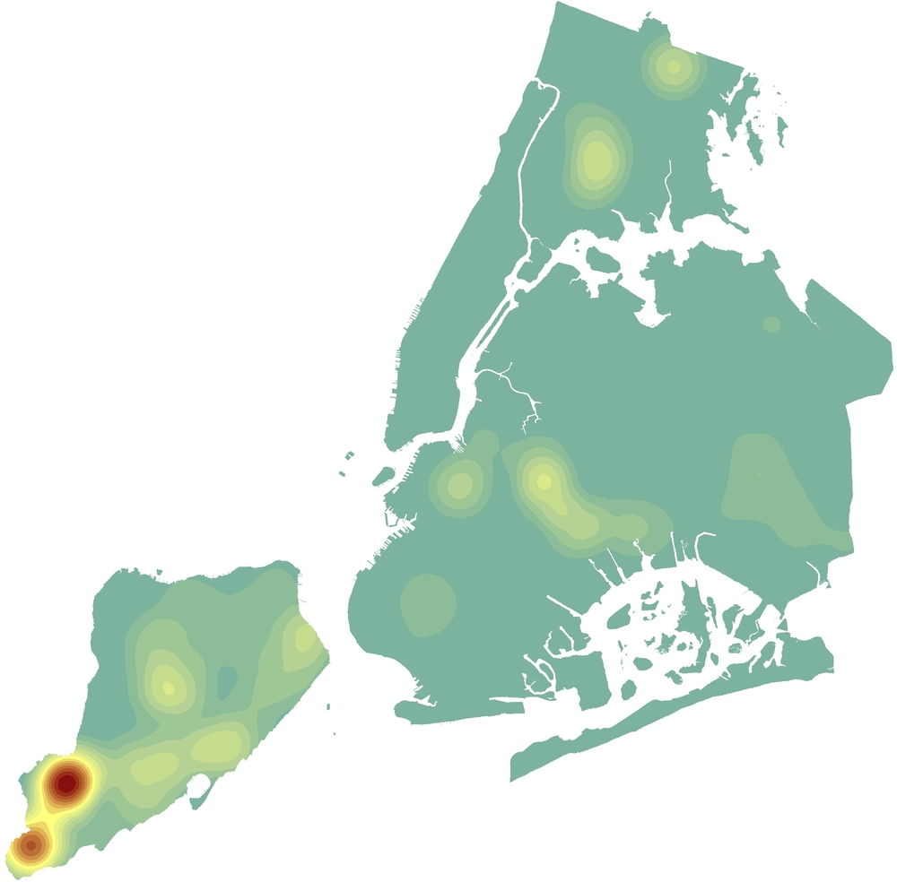

### About Me

Coming soon...

### Web Map Applications
- [Facade Filings](https://benmancell.github.io/FacadeFilings/index_facade_cycle9.html){:target="_blank"}

- [Major Construction](https://benmancell.github.io/ActiveNB_A1enlargements/index_ChartsLyrs.html){:target="_blank"}

- [Community Profiles](https://benmancell.github.io/CommunityProfiles/index.html){:target="_blank"}

- [Active Sidewalk Sheds](https://benmancell.github.io/ActiveShedPermits/index_ChartsLyrs.html){:target="_blank"}

- [Sustainability (Greenhouse Gas Emission and Energy Grades)](https://benmancell.github.io/SustainabilityMaps/){:target="_blank"}

- [Local Law 104](https://benmancell.github.io/LL104/index_vioUnitRatio.html){:target="_blank"}

- [Violations](https://benmancell.github.io/Violations/index_choropleth_txt.html){:target="_blank"}

### Dashboards
- [Citywide Performance Reporting (CPR)](https://benmancell.github.io/CitywidePerformanceReporting/index.html){:target="_blank"}

- [Mobile Summons](https://benmancell.github.io/MobileSummonsDashboard/index2.html){:target="_blank"}

- [NYC Construction Dashboard](https://benmancell.github.io/ConstructionDashboard_2021/index.html){:target="_blank"}

- [Strategy Tracker](https://benmancell.github.io/StrategyTracker/){:target="_blank"}

### Data Visualizations
- [Complaint Response Time (Sankey Diagram)](https://benmancell.github.io/SankeyDiagram/index.html){:target="_blank"}

- [Vacates Issued (Bubble Chart)](https://benmancell.github.io/BubbleChart/index_vacates.html){:target="_blank"}

- [Permits & Sub-Permits (Sunburst Chart)] (https://benmancell.github.io/SunburstChart/index.html){:target="_blank"}
- 
### Press

Coming soon...
