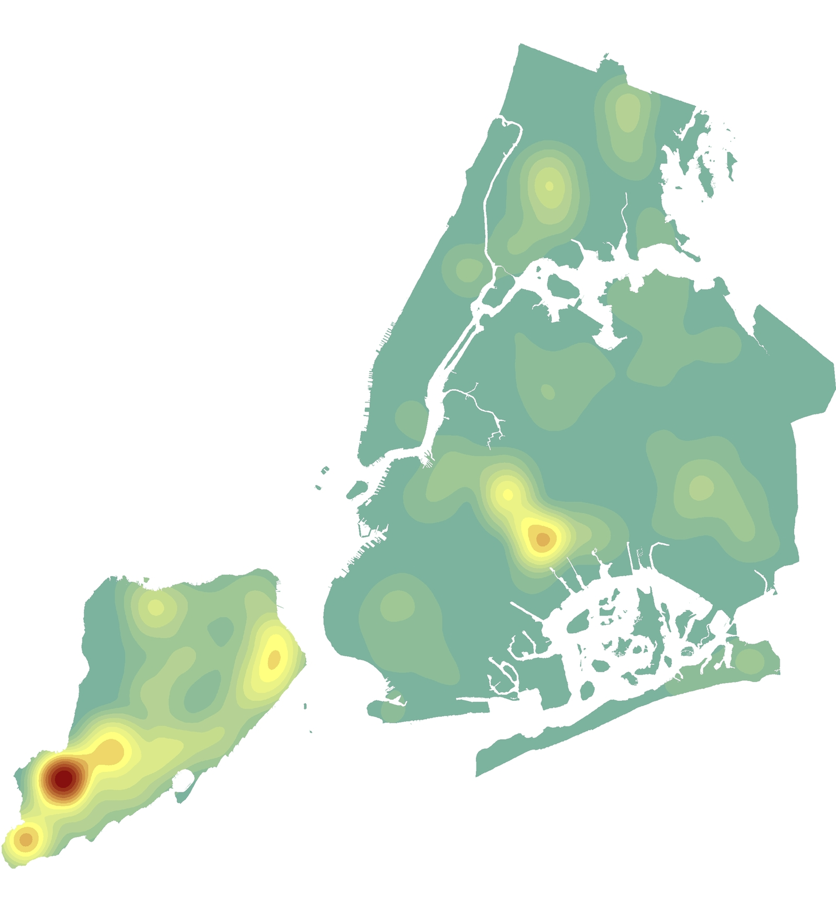

### About Me

You can use the [editor on GitHub](https://github.com/benmancell/benmancell.github.io/edit/main/index.md) to maintain and preview the content for your website in Markdown files.

Whenever you commit to this repository, GitHub Pages will run [Jekyll](https://jekyllrb.com/) to rebuild the pages in your site, from the content in your Markdown files.

### Web Map Applications
- [Facade Filings](https://benmancell.github.io/FacadeFilings/index_facade_cycle9.html){:target="_blank"}

- [Major Construction](https://benmancell.github.io/ActiveNB_A1enlargements/index_ChartsLyrs.html){:target="_blank"}

- [Community Profiles](https://benmancell.github.io/CommunityProfiles/index.html){:target="_blank"}

- [Active Sidewalk Sheds](https://benmancell.github.io/ActiveShedPermits/index_ChartsLyrs.html){:target="_blank"}

- [Sustainability (Greenhouse Gas Emission and Energy Grades)](https://benmancell.github.io/SustainabilityMaps/){:target="_blank"}

- [Local Law 104](https://benmancell.github.io/LL104/index_vioUnitRatio.html){:target="_blank"}

- [Violations](https://benmancell.github.io/Violations/index_choropleth_txt.html){:target="_blank"}

### Dashboards
- [Citywide Performance Reporting (CPR)](https://benmancell.github.io/CitywidePerformanceReporting/index.html){:target="_blank"}

- [Mobile Summons](https://benmancell.github.io/MobileSummonsDashboard/index2.html){:target="_blank"}

- [NYC Construction Dashboard](https://benmancell.github.io/ConstructionDashboard_2021/index.html){:target="_blank"}

- Strategy Tracker

- Sankey Visualization

- Bubble Visualization

### Press

Coming soon...

### Support or Contact

Having trouble with Pages? Check out our [documentation](https://docs.github.com/categories/github-pages-basics/) or [contact support](https://support.github.com/contact) and we’ll help you sort it out.
