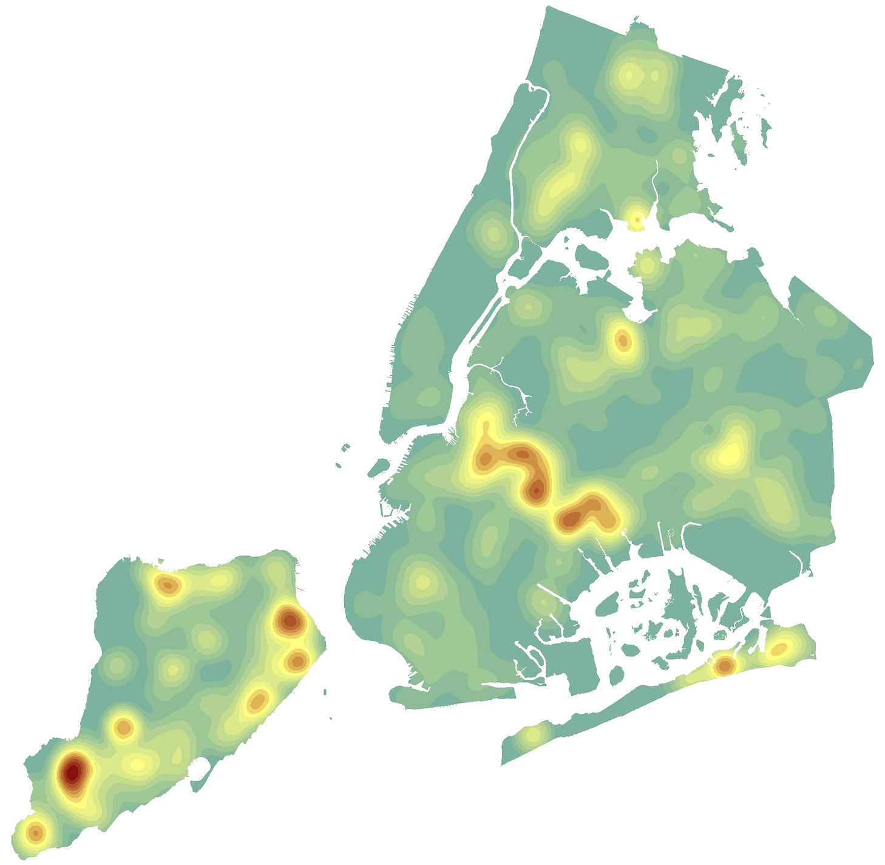

### About Me

You can use the [editor on GitHub](https://github.com/benmancell/benmancell.github.io/edit/main/index.md) to maintain and preview the content for your website in Markdown files.

Whenever you commit to this repository, GitHub Pages will run [Jekyll](https://jekyllrb.com/) to rebuild the pages in your site, from the content in your Markdown files.

### Web Map Applications

[Active New Building and Major Alteration Permits](https://benmancell.github.io/ActiveNB_A1enlargements/index_ChartsLyrs.html).

### Dashboards

Your Pages site will use the layout and styles from the Jekyll theme you have selected in your [repository settings](https://github.com/benmancell/benmancell.github.io/settings/pages). The name of this theme is saved in the Jekyll `_config.yml` configuration file.

### Press

Coming soon...

### Support or Contact

Having trouble with Pages? Check out our [documentation](https://docs.github.com/categories/github-pages-basics/) or [contact support](https://support.github.com/contact) and we’ll help you sort it out.
